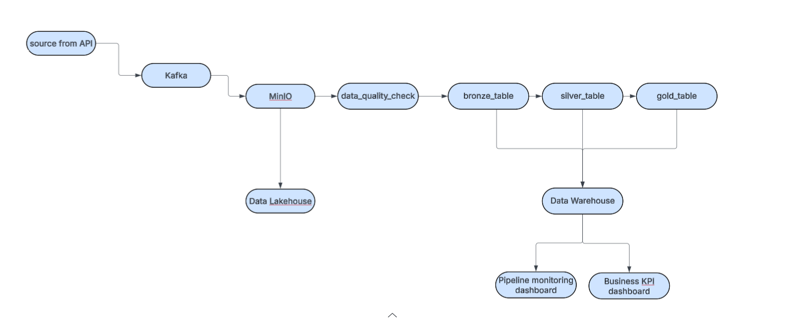
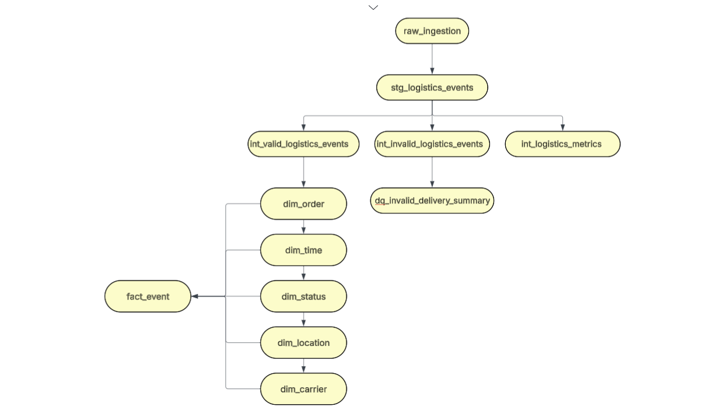
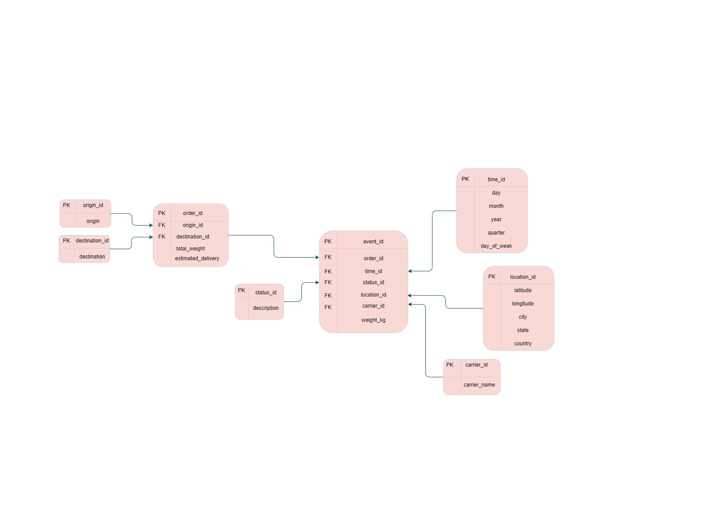

# Logistics Data Pipeline


## Overview

Built a real-time logistics data pipeline simulating order tracking events across the full data engineering stack. The pipeline generates synthetic events via a FastAPI service, streams them through Kafka, lands them in MinIO as Parquet files, and loads them into DuckDB. A custom data quality gate validates records before dbt transforms the raw data into a star schema using medallion architecture (bronze → silver → gold). Apache Airflow orchestrates the entire workflow on an hourly schedule inside Docker, with two Streamlit dashboards surfacing pipeline health metrics and business KPIs.

## Architecture



> FastAPI generator → Kafka → MinIO (bronze) → DuckDB → dbt (silver/gold) → Streamlit

## dbt Lineage



> Raw ingestion flows through staging → intermediate (valid/invalid split) →
> dimension tables (dim_order, dim_carrier, dim_location, dim_status, dim_time) → fact_event

## Data Model (Star Schema)



The warehouse is modelled as a star schema centred on `fact_event`. Each row represents
a single logistics event joined to five dimension tables:

| Table | Type | Description |
|---|---|---|
| `fact_event` | Fact | One row per logistics event with FK references and `weight_kg`, `is_late_delivery` measures |
| `dim_order` | Dimension | Order details — origin, destination, total weight, estimated delivery |
| `dim_time` | Dimension | Time attributes — day, month, year, quarter, day of week |
| `dim_location` | Dimension | Location attributes — latitude, longitude, city, state, country |
| `dim_status` | Dimension | Event status description |
| `dim_carrier` | Dimension | Carrier name |

## Stack

| Layer | Tool |
|---|---|
| Ingest | FastAPI + Kafka |
| Storage | MinIO (S3) + DuckDB |
| Transform | dbt (star schema) |
| Orchestrate | Apache Airflow (Docker) |
| Visualize | Streamlit |

## Prerequisites

- Docker + Docker Compose
- Python 3.12
- 8GB RAM minimum (Kafka + Airflow are memory heavy)

## Quick start
```bash
# 1. Start all services
docker compose up -d

# 2. Generate synthetic events
curl -X POST "http://localhost:8000/generate-batch?count=50"

# 3. Trigger the pipeline
docker exec -it logistics_data_pipeline-airflow-scheduler-1 airflow dags trigger logistics_data_pipeline

# 4. View dashboards
streamlit run src/dashboards/pipeline_monitoring_dashboard.py
streamlit run src/dashboards/Business_KPI_dashboard.py
```

## Service ports

| Service | URL |
|---|---|
| Airflow UI | http://localhost:8081 |
| MinIO console | http://localhost:9001 |
| Generator API | http://localhost:8000/docs |
| Streamlit | http://localhost:8501 |
| Kafka broker | localhost:9092 |

## Project structure
```
Logistics_Data_Pipeline/
├── src/
│   ├── api/                  # FastAPI synthetic data generator
│   ├── stream/               # Kafka consumer → MinIO
│   ├── warehouse/            # DuckDB init + data quality checks
│   └── dashboards/           # Streamlit apps
├── logistics_pipeline/       # dbt project
│   └── models/layer/
│       ├── staging/          # bronze — stg_logistics_events
│       ├── intermediate/     # silver — valid/invalid splits + DQ summary
│       ├── dimension/        # dim_order, dim_carrier, dim_location …
│       └── facts/            # fact_event (star schema)
├── Logistics_data_pipeline_docs/   # architecture + lineage + data model images
├── airflow/
│   └── dags/                 # logistics_dag.py
├── Dockerfile                # custom Airflow image
├── Dockerfile.generator      # lightweight generator image
└── docker-compose.yaml
```

## DAG task order
```
stream_to_minio → load_to_duckdb → data_quality_check → dbt_transform → dbt_test → log_success
```

## Default credentials

| Service | Username | Password |
|---|---|---|
| Airflow | airflow | airflow |
| MinIO | minioadmin | minioadmin |

## Notes

- Designed for local development. DuckDB allows only one writer at a time —
  close Streamlit dashboards before triggering the DAG.
- Kafka topic `logistics-events` is recreated automatically on restart via
  `KAFKA_AUTO_CREATE_TOPICS_ENABLE`.
- Data persists across restarts via Docker named volumes (`postgres_db`, `minio_data`).
